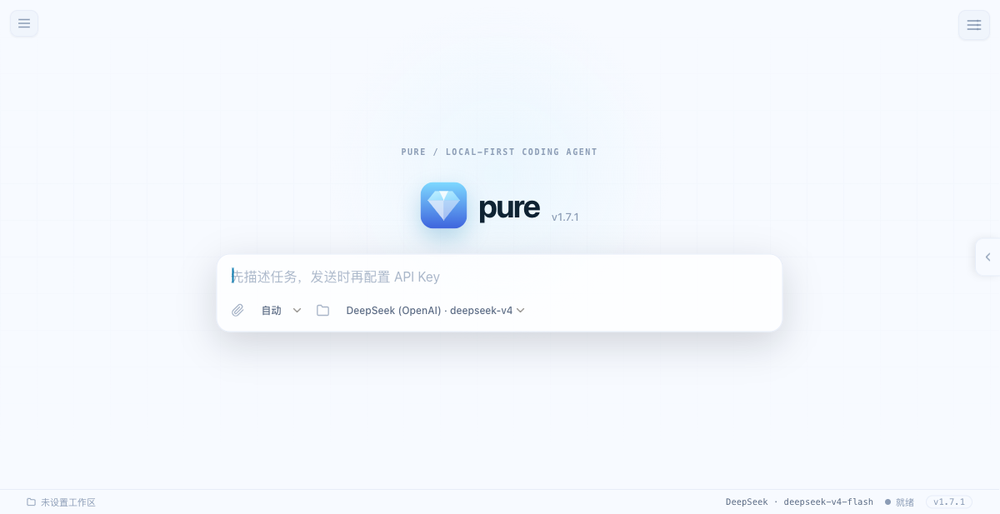
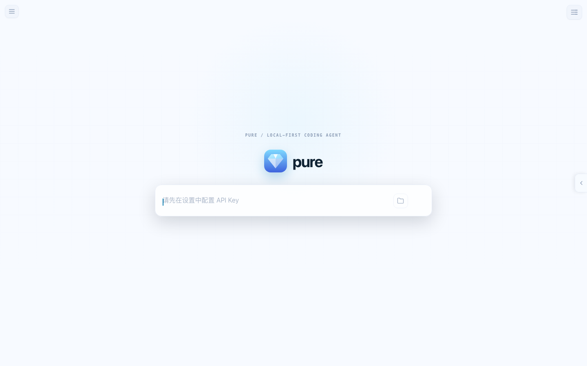
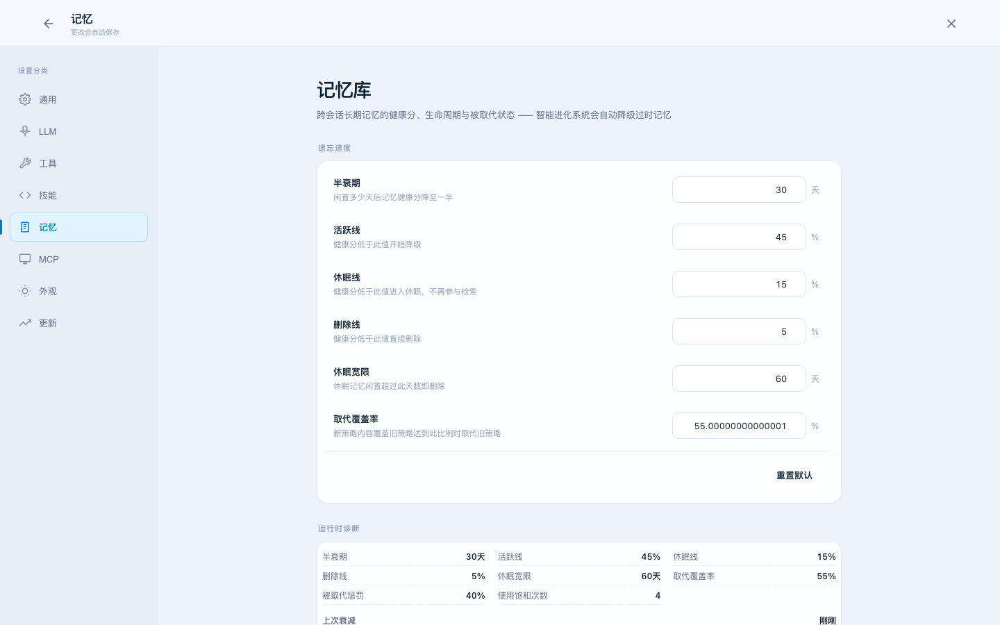

# Pure

**Pure** is a local-first coding agent built around two ideas: **a loop that refuses to stop at the first plausible answer, and memory that learns without becoming a transcript dump**. It reads, writes, and edits files, executes shell commands, can verify its work when a verifier is configured, and carries compact project lessons across sessions — through a fast terminal CLI or a native macOS desktop app.

<p align="center">
  
  
  
</p>

---

## Screenshots & architecture

<p align="center">
  
  <br />
  <em>Current application shell — workspace state, task composer, task mode/model controls, and project context panel</em>
  <br /><br />
  
  <br />
  <em>Current landing page — workspace picker, task composer, mode/model controls, and status bar</em>
  <br /><br />
  
  <br />
  <em>Current memory workspace — forgetting speed, runtime diagnostics, and memory export/import controls</em>
  <br /><br />
  
  <br />
  <em>Architecture diagram — evidence-driven execution and evolving project memory</em>
</p>

---

## Why Pure is different

Most coding agents are described by the tools they can call. Pure is defined by **what happens after a tool call**:

| | A basic tool-calling assistant | Pure |
|---|---|---|
| **Execution** | Prompt → tool → answer | A visible `THINK → ACT → OBSERVE → VERIFY` loop that can continue until the evidence supports completion |
| **Failure** | Retry the same path or stop with an error | Escalating recovery: `retry → reflect → degrade → stop`, with repeated-error and logical-trap detection |
| **Context** | Conversation history grows or is manually reset | Checkpoints, context trimming, and project-scoped memory keep the next turn focused |
| **Learning** | Preferences are usually re-explained by the user | Compact lessons from successful work, failed tools, and harvested preferences are retrieved on similar tasks; explicit project conventions can also be stored or imported |
| **Memory hygiene** | Old context accumulates indefinitely | Health scores, usage signals, superseding, and decay move stale lessons through `active → degraded → dormant → delete` |

This is not a claim that every other agent behaves identically; it is Pure's design choice: **execution is a state machine, and experience is a maintained library**.

### 1. The Agent Loop: evidence before completion

Pure's engine is a streaming five-state event loop:

```text
THINK → ACT → OBSERVE ──┐
  ↑                     │
  └────────── VERIFY ←──┘
              │
          TERMINATE
```

- **THINK** — plan the next move with the current request, tools, budget, and relevant memory.
- **ACT** — execute tool calls with permissions, file locks, parallel read-only work, and serialized writes.
- **OBSERVE** — put tool results back into the working context as evidence, not as an invisible side effect.
- **VERIFY** — when a verifier is configured, run it before calling the task complete. The built-in CodingAgent/CLI path includes rule-based checks; integrations can supply a custom verifier. A failed verification loops back to THINK with a reflection note.
- **TERMINATE** — complete after configured verification passes, or stop safely when no verifier is configured or the budget, policy, or user signal requires it.

The loop has explicit budget tracking (turns, tokens, tool calls, and time), lifecycle hooks, and failure recovery. Repeated identical failures are recognized as a dead end; the agent is told to change approach instead of grinding the same call.

### 1.5 Proactive preflight: think before changing

Before a coding request reaches the execution loop, `Planner` performs a lightweight intent and risk assessment. It considers what the user is asking, the likely blast radius, reversibility, and whether a read-only probe can reduce uncertainty:

| Assessment | Default behavior |
|---|---|
| **Low risk** | Read the relevant content, execute directly, and verify the result. Small single-file artifacts stay on this path. |
| **Medium risk** | Explore the workspace read-only first, then make a narrow change and verify it before expanding scope. |
| **High risk** | Explain impact, reversibility, and a safer/narrower alternative; both GUI and CLI require explicit interactive approval before any write or destructive command. The CLI remains auto-approved by default for ordinary turns, while `--prompt-on-tool` adds interactive confirmation for every tool call. |

This is a strategy layer, not a replacement for per-tool permissions. CLI and GUI may present the assessment differently, but both receive the same functional contract in the request context. A new high-risk follow-up also reopens the safety review instead of silently continuing an earlier plan.

### 1.55 Unified request workflow: evidence before action

The request lifecycle is compiled once by `src/shared/requestWorkflow.ts` and consumed by both GUI and CLI. The compiler combines the request, Planner assessment, explicit mode, active plan state, and available tools into a small dynamic decision: `direct`, `probe`, `plan`, or `confirm`. It also produces the request-scoped Prompt fragments instead of making each surface reconstruct them independently.

```text
intake → assess → [read-only probe when required and available]
       → [task-specific plan when useful] → [approval when required]
       → execute → verify → deliver
```

The workflow is deliberately a compiler, not a fixed task script: the LLM still chooses the concrete files, steps, delegation, and verification from workspace evidence. `probeRequired` and `probeAvailable` remain separate, so a missing workspace or disabled tool is reported as a capability limitation rather than silently pretending that discovery happened. After the GUI's task-specific LLM analysis, the final risk assessment is recompiled into the user-turn context before execution. The GUI may show this extra streamed analysis as a user-facing thinking card; the CLI intentionally skips a second preflight model round and lets the main execution LLM plan from the same compiled evidence, keeping latency and cost lower. Both surfaces retain the same conservative rule-based safety floor and per-tool permission gate.

### 1.56 Adaptive runtime control: change the strategy, not the safety boundary

The first-stage adaptive control plane lives in `src/shared/adaptiveControl.ts` and runs inside the shared Harness path used by CLI and GUI. Each turn compiles a strategy from live signals — workspace capability, available tools, verifier availability, local time, retrieved procedures, and recent failure/verification evidence — then injects it into a separate `<adaptive_context>` fragment.

The strategy can change exploration depth, verification strength, delegation preference, recovery posture, and unattended-local autonomy. It is a recommendation, not a fixed task script: the model must revise it when new evidence disagrees. Permissions, path boundaries, destructive-operation confirmation, execution budgets, and verifier evidence remain programmatic invariants and cannot be weakened by adaptive context.

A completed run records the selected strategy alongside its outcome. Only runs with real verification evidence promote the strategy note into reusable `procedure` memory; unverified output is retained as session information but cannot teach future runs to trust an unproven path. This makes the same request capable of taking different paths as the workspace, time, tools, memory, and evidence change without allowing self-improvement to bypass safety controls.

### 1.6 Context compaction: automatic, inspectable, reversible

Context management is independent of task complexity. `ContextEngine` keeps the current system messages, folds older compaction summaries, retains complete assistant/tool-call groups, removes invalid dangling tool fragments, and trims older conversational groups by message and estimated-token budgets. LLM summarization is best-effort: if it fails, the bounded recent window still reaches the model and the UI reports that older messages were trimmed without a summary.

Compaction does not encode a fixed number of plan steps, Todo items, or verification stages. Those remain model- and task-dependent. The CLI REPL exposes `/compact`; the GUI composer exposes `⌁`. Both actions prepare the next execution context without deleting the visible transcript. Automatic GUI pre-compaction uses the same engine during idle time, while the CLI and Harness invoke it before a continuation when needed.

### 1.65 Session memory and UI transcript are separate

The GUI does not treat everything visible on screen as LLM memory. V2 session snapshots have three explicit layers: `modelContext.messages` contains the canonical messages sent to the next LLM request; `transcript` stores UI-only analysis, reasoning phases, tool parameters/results, rich Markdown, and artifact cards; `uiState` stores UI runtime state such as the plan cursor and paused-plan status.

History restore first loads `modelContext.messages` back into the agent, then `src/ui/transcriptProjection.ts` projects `transcript` into user messages, analysis cards, thinking phases, tool rows, assistant replies, assessment cards, and artifact cards for the UI renderer. Legacy `displayContent`-style fields never backfill an empty model message, so presentation data cannot contaminate the next LLM request; context compaction changes only the model window and does not delete the visible transcript.

Legacy `StoredMessage[]` data is migrated to V2 on read. Tool calls are paired by `toolCallId`; unreturned calls replay as stopped rows; older sessions without `toolExec` recover tool metadata from the tool message and its preceding call. See [`docs/session-persistence-and-transcript.md`](docs/session-persistence-and-transcript.md) for the field contract, save/restore flow, compatibility rules, and optimization roadmap.

### 1.7 Prompt observability: inspect the agent without storing secrets

Pure includes a local-first observability path for prompt assembly and agent runs. The compiler records fragment selection, provider/model budget, tool-schema cost, and trace correlation; the Harness records event counts, tool durations, usage, verification status, and terminal outcome. By default, observations retain lengths, hashes, and structured metadata — not raw prompts, tool arguments, command output, or final answers. An explicit JSONL sink is available for evaluation and debugging runs.

### 1.8 Real coding-task evaluation baseline

The repository includes three deterministic bugfix/feature/refactor fixtures, isolated per task in disposable workspaces and checked by real Bun verification commands. Run without `--agent` for the `0/3` control sanity baseline, or run the real CodingAgent executor against a provider:

```bash
bun run eval:baseline
PURE_EVAL_API_KEY=... bun run eval:baseline -- --agent deepseek-openai --strict --report evals/model.latest.json
PURE_EVAL_TRACE=evals/traces.jsonl bun run eval:baseline -- --agent deepseek-openai
```

Reports separate agent completion from verification success and include fixture hash, runtime, provider/model, prompt version, usage, duration, and cost metadata. The baseline is a reproducible regression gate, not a replacement for SWE-bench or Terminal-Bench.

### 2. Memory that evolves with the project

Pure's memory is not a second chat transcript. The Harness turns a completed session into compact, reusable entries such as:

- **User preferences** — language, framework, tooling, or style choices extracted from what the user explicitly states.
- **Procedures and successful patterns** — what worked, why it worked, and how it was verified; successful sessions write both a reusable lesson and a shorter procedure.
- **Project conventions** — workspace rules that are explicitly captured or imported, stored with the project path rather than mixed into a global memory pool.
- **Error patterns** — dead ends and recovery paths, including calls that should not be repeated.

At the start of a similar task, Pure retrieves only the top relevant memories and injects them into a dedicated `<session_memory>` prompt section. GUI/CLI project isolation prevents one repository's conventions from silently leaking into another.

Retrieval uses local WASM embeddings when available, with a keyword-search fallback when the model, network, or runtime is unavailable. Memory stays useful over time through a multi-dimensional health score (recency, credibility, usage, and superseded state): new lessons can supersede outdated ones, while idle entries decay from active to degraded to dormant and eventually disappear. The GUI exposes diagnostics, forgetting-speed controls, and JSON/Markdown export/import.

> **The practical difference:** Pure can remember *"this project prefers X"* and *"that exact failed call is a dead end"* without replaying the entire previous session.

### Features

- **Terminal CLI** — One-shot prompts or interactive REPL with streaming output
- **Desktop GUI** — Native macOS app (Tauri) with Notion-style sidebar and settings
- **Multi-provider** — DeepSeek, Qwen (Tongyi), GLM (Zhipu), plus custom OpenAI-compatible endpoints
- **Self-correcting Agent Loop** — THINK → ACT → OBSERVE → VERIFY → TERMINATE with budgets, hooks, locks, and recovery policy
- **Evolving project memory** — Semantic retrieval, keyword fallback, decay, superseding, diagnostics, and export/import
- **Subagent Orchestration** — Spawn file-pickers, code-searchers, web researchers in parallel
- **MCP Protocol** — Connect Model Context Protocol servers for extensible tooling
- **Proactive preflight** — Classify intent, impact, reversibility, and risk before acting; probe medium-risk work and require explicit confirmation for high-risk changes in both GUI and CLI (or use CLI `--prompt-on-tool` for every tool call)
- **Unified request workflow** — Shared GUI/CLI intake, probe, plan, confirmation, execution, and verification decisions with dynamic request-scoped Prompt context
- **Adaptive runtime control** — Environment- and evidence-aware exploration, delegation, recovery, verification, and unattended-local strategy selection shared by CLI, GUI, and Harness
- **Permission System** — Four modes: YOLO (auto-approve), NORMAL (prompt per write), PLAN (read-only), DONT_ASK (silent block)
- **Session Persistence** — Checkpoint-based state with resume support (`pure --resume`)
- **Current-session undo** — CLI `/undo` and GUI ↶ restore the latest successful write batch; restores only when the workspace has not been changed afterward
- **Context compaction** — automatic bounded history plus CLI `/compact` and GUI `⌁`; tool-call pairs stay valid, provider/model-aware prompt budgets count message + tool/MCP schema tokens, omit low-priority fragments first, support custom model metadata, and emit diagnostics when content is omitted
- **Prompt observability** — local trace correlation across PromptAssembler and Harness, privacy-preserving hashes, bounded memory storage, and opt-in versioned JSONL export
- **Coding-task evaluation** — isolated real fixtures, control baseline, provider-backed CodingAgent runner, verification-only scoring, usage/cost metadata, and strict CI-friendly exit codes
- **Fault-tolerant parsing** — Repair malformed JSON, Mermaid, and SVG before surfacing an error
- **Auto-updater** — GUI checks for updates via signed `.app.tar.gz` artifacts
- **Multi-language UI** — English / Chinese interface

> 📖 中文文档 → [README_zh.md](README_zh.md)

---

## Quick Start

### CLI

```bash
# 1. Install Bun (https://bun.sh)
curl -fsSL https://bun.sh/install | bash

# 2. Clone & install
git clone https://github.com/archerzing-tech/pure.git
cd pure
bun install

# 3. Configure your API key (saved to ~/.pure/config.json)
bun run cli -- config

# 4. Start coding
bun run cli -- "Explain the architecture of this project"
```

Or download the pre-built binary from [Releases](https://github.com/archerzing-tech/pure/releases):

```bash
./pure "Implement a rate limiter in TypeScript"
./pure --workspace /path/to/project    # REPL mode with file/command tools
./pure --resume abc123                 # Resume a previous session
```

### GUI (macOS)

Download `pure_*.dmg` from [Releases](https://github.com/archerzing-tech/pure/releases), mount, and drag to `/Applications`. Or build from source:

```bash
bun install
bun run gui          # dev mode with hot reload
bun run gui:build    # production build → src-tauri/target/release/bundle/
```

---

## Architecture

```
┌─────────────────────────────────────────────────┐
│                   Desktop Shell                  │
│          (Tauri 2 · WebView · Vanilla TS)         │
├─────────────────────────────────────────────────┤
│  Coding Agent                                    │
│  Planner · Intent · Permission · Verifier        │
├─────────────────────────────────────────────────┤
│  Harness (stateful session manager)              │
│  StateManager · ContextEngine · StreamManager     │
├─────────────────────────────────────────────────┤
│  Agent-Event-Loop Engine (stateless ReAct loop)  │
│  THINK → ACT → OBSERVE → VERIFY → TERMINATE      │
├─────────────────────────────────────────────────┤
│  Adapter Layer (all I/O)                         │
│  LLM (DeepSeek/Qwen/GLM) · Tools · Storage · MCP │
├─────────────────────────────────────────────────┤
│  Rust / Tauri IPC (OS capabilities)              │
│  Shell PTY · File Watcher · Keyring · HTTP/2     │
└─────────────────────────────────────────────────┘
```

The agent core runs in TypeScript inside the WebView. Rust (Tauri) provides OS-level capabilities — shell PTY streaming, file watching, keyring access, and LLM API relay (keeping API keys out of the JS context).

---

## Project Structure

```
pure/
├── src/
│   ├── cli.ts                    # CLI entry point (one-shot + REPL)
│   ├── engine/                   # Stateless ReAct event loop
│   │   ├── AgentLoopEngine.ts    # 5-state loop with budget + hooks
│   │   ├── BudgetManager.ts      # Token/turn/time budget tracking
│   │   └── FailurePolicy.ts      # Escalating recovery: retry → reflect → stop
│   ├── harness/                  # Stateful session management
│   │   ├── Harness.ts            # Session lifecycle + checkpoint persistence
│   │   ├── ContextEngine.ts      # Automatic/manual context compaction
│   │   ├── StateManager.ts       # Checkpoint save/restore
│   │   └── StreamManager.ts      # Token streaming + UI rendering
│   ├── coding-agent/             # Application layer
│   │   ├── CodingAgent.ts        # Main agent assembler
│   │   ├── Planner.ts            # Intent/risk analysis + plan generation
│   │   ├── ToolRegistry.ts       # Tool dispatch + permission gating
│   │   ├── PermissionManager.ts  # YOLO / NORMAL / PLAN modes
│   │   ├── Verifier.ts           # Output verification
│   │   └── SubagentOrchestrator.ts  # Parallel subagent spawning
│   ├── adapter/                  # I/O adapters (LLM, tools, storage, MCP)
│   │   ├── openai/               # OpenAI-compatible API adapter
│   │   ├── deepseek/             # DeepSeek Anthropic-style adapter
│   │   ├── node/                 # File system + shell tool adapter
│   │   ├── mcp/                  # MCP transport (stdio, HTTP)
│   │   └── storage/              # FSStore + SQLiteStore
│   ├── ui/                       # WebView UI (chat, settings, markdown)
│   └── shared/                   # Shared types, prompt assembly, observability, i18n, memory
│       ├── PromptAssembler.ts    # Unified GUI / CLI / Harness prompt compiler
│       ├── adaptiveControl.ts     # Runtime strategy selection from environment/evidence
│       ├── requestWorkflow.ts     # Shared dynamic intake/probe/plan/confirm compiler
│       ├── promptObservability.ts # Privacy-preserving trace model + collector
│       └── FilePromptObservationStore.ts # Node-only JSONL trace sink
│   ├── evaluation/               # Deterministic coding-task fixtures + real runner
│   │   ├── codingTaskBaseline.ts  # Fixtures, verification, reports
│   │   └── codingAgentExecutor.ts # Provider-backed CodingAgent executor
├── evals/                        # Evaluation protocol and baseline documentation
├── src-tauri/                    # Rust / Tauri backend
│   ├── src/                      # IPC commands, session manager
│   └── tauri.conf.json           # App config + updater keys
├── scripts/                      # Build, sign, deploy scripts
├── system-prompt.md              # Agent system prompt (public contract)
└── pure Spec.md                  # Architecture master spec
```

---

## Configuration

### Provider & API Key

Set up once with `pure config` (CLI) or the Settings panel (GUI). The config is persisted to `~/.pure/config.json`.

Supported providers:

| Provider | CLI flag | Env var |
|---|---|---|
| DeepSeek (OpenAI API) | `--provider deepseek-openai` | `DEEPSEEK_API_KEY` |
| DeepSeek (Anthropic API) | `--provider deepseek-anthropic` | `DEEPSEEK_API_KEY` |
| Qwen / DashScope | `--provider qwen` | `DASHSCOPE_API_KEY` |
| GLM / Zhipu | `--provider glm` | `ZHIPU_API_KEY` |

The GUI Settings → LLM page supports multiple models per provider. The compact default view shows the active provider and model; use **Choose provider** to switch provider and its model library, **Manage model library** to add/remove models or set the default, and **Test connection** to probe the selected endpoint. API key and Base URL fields remain available under Connection settings.

### Permission Modes

| Mode | Reads | Writes & Shell Commands |
|---|---|---|
| **YOLO** | Auto-approved | Auto-approved |
| **NORMAL** (default) | Auto-approved | Prompt per operation |
| **PLAN** | Allowed | Blocked |
| **DONT_ASK** | Auto-approved | Silently blocked |

---

## CLI Usage

```bash
# One-shot: ask a question or perform a task
pure "Refactor the auth module to use JWT"
pure "What does AgentLoopEngine.ts do?"

# REPL: interactive session in current directory
pure --workspace .

# Resume a previous session
pure --resume session_1712345678901

# Override provider/model per invocation
pure --provider qwen --model qwen3-coder-next "Write a React hook for form validation"

# REPL commands
/exit       # leave
/clear      # reset conversation context
/compact    # compact the next execution context without deleting visible history
Ctrl+C      # cancel current generation (press twice to force quit)
/undo       # restore the latest successful write batch in this session
```

The GUI exposes the same current-session undo action as ↶ beside the composer and a `⌁` context-compaction action. Compaction changes only the next execution window; it does not delete the visible transcript. Undo remains intentionally memory-only for the active process: it does not replace cross-session checkpoints or delete files outside the workspace.

To add interactive confirmation before individual tool calls:

```bash
pure --prompt-on-tool "Run the migration"
```

### Coding-task evaluation

```bash
bun run eval:baseline                                      # control baseline (expected 0/3)
PURE_EVAL_API_KEY=... bun run eval:baseline -- --agent deepseek-openai --strict
PURE_EVAL_TRACE=evals/traces.jsonl bun run eval:baseline -- --agent deepseek-openai
```

Supported executor providers are `deepseek-openai`, `deepseek-anthropic`, `qwen`, `glm`, `mock`, and custom OpenAI-compatible endpoints via `PURE_EVAL_BASE_URL`. Evaluation workspaces are isolated per task; reports contain hashes and metadata rather than source or command output.

---

## Development

```bash
# Install dependencies
bun install

# Type-check
bun run typecheck

# Run tests
bun test

# CLI (development)
bun run cli

# GUI (development, with hot reload)
bun run gui

# Build binaries
bun run cli:build          # → ./pure (standalone CLI binary)
bun run gui:build          # → .app + .dmg + .tar.gz for auto-updater
```

### Build Release (macOS)

```bash
# Full build with Tauri updater signing + macOS code signing
bun run build:gui:mac
```

For CI/CD, the project includes a GitHub Actions workflow (`.github/workflows/release.yml`) that builds both CLI and GUI on every `v*` tag push.

---

## Chart DSL

In chat replies, a ```` ```chart ```` code block renders as a chart (bar, horizontal bar, line, pie, scatter, kline, radar, tree, treemap, sunburst) using a tiny DSL:

````markdown
```chart
type: line
title: 北京 vs 上海气温
unit: ℃
周一 25 27
周二 26 28
周三 24 26
```
````

Each non-`type:`/`title:`/`unit:` line is one data row: `label value` for single-series charts, or `label v1 v2 …` for multi-series.

### Multi-series (header + multiple columns)

Adding a header row with two or more numeric columns renders **one series per column** — first column is the x-axis label, the rest are series names. Hovering a category shows all series side-by-side in the tooltip (axis-linked).

````markdown
```chart
type: line
title: 三地气温对比
unit: ℃
日期 北京 上海 广州
周一 25 27 30
周二 26 28 31
周三 24 29 32
```
````

The same shape works as a **markdown table** (with optional `---` separator row), **CSV**, or **tab-separated** rows:

````markdown
```chart
type: line
| 月份 | 电商 | 门店 | 批发 |
| --- | --- | --- | --- |
| 一月 | 120 | 80 | 60 |
| 二月 | 150 | 90 | 55 |
```
````

Multi-series also works for `bar` and `hbar`; a `pie` chart always uses the first column as values (multiple series would overlap as donuts).

### Other chart families

```chart blocks cover more of ECharts' chart library, each with its own data shape:

- **scatter** — one point per line: `name x y`.

````markdown
```chart
type: scatter
title: 身高体重分布
小明 170 65
小红 160 50
```
````

- **kline** — a header `日期 开盘 收盘 最低 最高` then `date open close low high` rows (that OHLC order is required).

````markdown
```chart
type: kline
日期 开盘 收盘 最低 最高
2026-08-01 10 12 9 13
2026-08-02 12 11 10 12
```
````

- **radar** — `indicators: 维度1 维度2 …` (or a header row of axis names), then one series per line: `名称 v1 v2 …`.

````markdown
```chart
type: radar
title: 团队技能
indicators: 速度 攻击 防御
团队A 80 90 70
团队B 60 70 80
```
````

- **tree / treemap / sunburst** — indentation defines the hierarchy (2 spaces per level), the first line is the root; for treemap/sunburst end a line with a number to set its value.

````markdown
```chart
type: treemap
销售
  电子 500
    手机 300
    电脑 200
  家电 300
```
````

### Rules & tips

- **Types**: `bar`, `hbar`, `line`, `pie`, `scatter`, `kline`, `radar`, `tree`, `treemap`, `sunburst` — `type:` line or a bare first word (Chinese shorthands like `散点图` / `雷达图` work too); default `bar`.
- **Series names**: taken from the header row; without a header they fall back to `系列1` / `系列2` / ….
- **Numeric first column**: a leading numeric token is always kept as the x-axis label — `2024 10 20` means the year is the label, not a data value.
- **Units**: `25℃`, `50%`, `1.2mm` are parsed and the unit is shown in tooltips/axis labels.
- **JSON**: `{ "type": "pie", "data": [["a", 1], ["b", 2]] }` is also accepted; hierarchy charts take `{ "type": "tree", "data": { "name": "root", "children": [...] } }`.
- **Interactions**: double-click any chart to open the fullscreen pan/zoom viewer; the floating download button exports PNG.
- Charts render via a lazy-loaded echarts build (tree-shaken, SVG renderer) and follow the app's light/dark theme automatically.
- To draw a chart or picture, emit the ```chart / ```svg block directly — never a Python/matplotlib script or other intermediate code in place of the final image.

---

## Updater

The GUI ships with Tauri's auto-updater. When a new version is published:

1. CI builds produce `pure.app.tar.gz` + `.sig` (minisign signature)
2. Host them at your update endpoint (`https://releases.pure.app/latest.json`)
3. The app polls the endpoint and prompts users to install the update

See [SIGNING.md](SIGNING.md) for key generation and update server setup.

---

## License

MIT — see [LICENSE](LICENSE)
