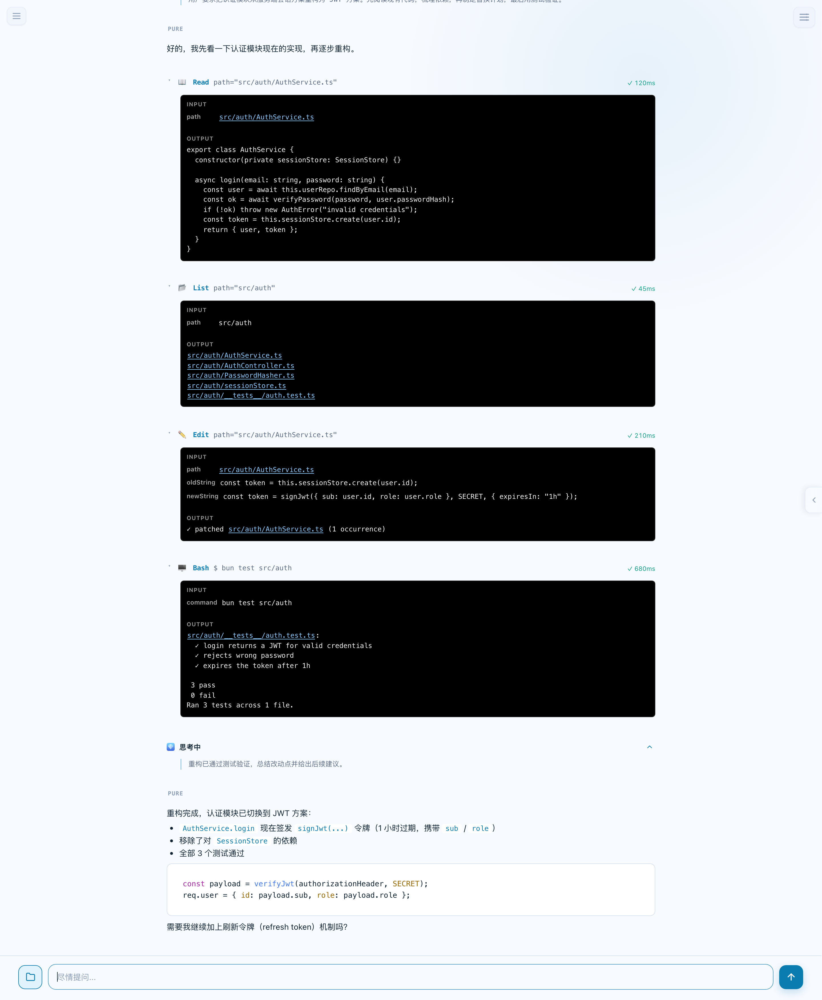

# Pure

**Pure** is a local-first AI coding agent that runs on your machine. It reads, writes, and edits files, executes shell commands, and orchestrates multi-agent workflows — all through a fast terminal CLI or a native macOS desktop app.

<p align="center">
  
  
  
</p>

---

## Screenshots

<p align="center">
  
  <br />
  <em>Landing page — pick a workspace and describe your task</em>
  <br /><br />
  
  <br />
  <em>Agent at work — file tools, shell output, and markdown answers rendered inline</em>
</p>

---

## Features

- **Terminal CLI** — One-shot prompts or interactive REPL with streaming output
- **Desktop GUI** — Native macOS app (Tauri) with Notion-style sidebar and settings
- **Multi-provider** — DeepSeek, Qwen (Tongyi), GLM (Zhipu), plus mock for testing
- **ReAct Agent Loop** — THINK → ACT → OBSERVE → VERIFY → TERMINATE with budget control
- **Subagent Orchestration** — Spawn file-pickers, code-searchers, web researchers in parallel
- **MCP Protocol** — Connect Model Context Protocol servers for extensible tooling
- **Permission System** — Four modes: YOLO (auto-approve), NORMAL (prompt per write), PLAN (read-only), DONT_ASK (silent block)
- **Session Persistence** — Checkpoint-based state with resume support (`pure --resume`)
- **Auto-updater** — GUI checks for updates via signed `.app.tar.gz` artifacts
- **Multi-language UI** — English / Chinese interface

> 📖 中文文档 → [README_zh.md](README_zh.md)

---

## Quick Start

### CLI

```bash
# 1. Install Bun (https://bun.sh)
curl -fsSL https://bun.sh/install | bash

# 2. Clone & install
git clone https://github.com/archerzing-tech/pure.git
cd pure
bun install

# 3. Configure your API key (saved to ~/.pure/config.json)
bun run cli -- config

# 4. Start coding
bun run cli -- "Explain the architecture of this project"
```

Or download the pre-built binary from [Releases](https://github.com/archerzing-tech/pure/releases):

```bash
./pure "Implement a rate limiter in TypeScript"
./pure --workspace /path/to/project    # REPL mode with file/command tools
./pure --resume abc123                 # Resume a previous session
```

### GUI (macOS)

Download `pure_*.dmg` from [Releases](https://github.com/archerzing-tech/pure/releases), mount, and drag to `/Applications`. Or build from source:

```bash
bun install
bun run gui          # dev mode with hot reload
bun run gui:build    # production build → src-tauri/target/release/bundle/
```

---

## Architecture

```
┌─────────────────────────────────────────────────┐
│                   Desktop Shell                  │
│          (Tauri 2 · WebView · Vanilla TS)         │
├─────────────────────────────────────────────────┤
│  Coding Agent                                    │
│  Planner · Permission · Verifier · Subagents     │
├─────────────────────────────────────────────────┤
│  Harness (stateful session manager)              │
│  StateManager · ContextEngine · StreamManager     │
├─────────────────────────────────────────────────┤
│  Agent-Event-Loop Engine (stateless ReAct loop)  │
│  THINK → ACT → OBSERVE → VERIFY → TERMINATE      │
├─────────────────────────────────────────────────┤
│  Adapter Layer (all I/O)                         │
│  LLM (DeepSeek/Qwen/GLM) · Tools · Storage · MCP │
├─────────────────────────────────────────────────┤
│  Rust / Tauri IPC (OS capabilities)              │
│  Shell PTY · File Watcher · Keyring · HTTP/2     │
└─────────────────────────────────────────────────┘
```

The agent core runs in TypeScript inside the WebView. Rust (Tauri) provides OS-level capabilities — shell PTY streaming, file watching, keyring access, and LLM API relay (keeping API keys out of the JS context).

---

## Project Structure

```
pure/
├── src/
│   ├── cli.ts                    # CLI entry point (one-shot + REPL)
│   ├── engine/                   # Stateless ReAct event loop
│   │   ├── AgentLoopEngine.ts    # 5-state loop with budget + hooks
│   │   ├── BudgetManager.ts      # Token/turn/time budget tracking
│   │   └── FailurePolicy.ts      # Escalating recovery: retry → reflect → stop
│   ├── harness/                  # Stateful session management
│   │   ├── Harness.ts            # Session lifecycle + checkpoint persistence
│   │   ├── ContextEngine.ts      # Context window trimming
│   │   ├── StateManager.ts       # Checkpoint save/restore
│   │   └── StreamManager.ts      # Token streaming + UI rendering
│   ├── coding-agent/             # Application layer
│   │   ├── CodingAgent.ts        # Main agent assembler
│   │   ├── Planner.ts            # Task analysis + plan generation
│   │   ├── ToolRegistry.ts       # Tool dispatch + permission gating
│   │   ├── PermissionManager.ts  # YOLO / NORMAL / PLAN modes
│   │   ├── Verifier.ts           # Output verification
│   │   └── SubagentOrchestrator.ts  # Parallel subagent spawning
│   ├── adapter/                  # I/O adapters (LLM, tools, storage, MCP)
│   │   ├── openai/               # OpenAI-compatible API adapter
│   │   ├── deepseek/             # DeepSeek Anthropic-style adapter
│   │   ├── node/                 # File system + shell tool adapter
│   │   ├── mcp/                  # MCP transport (stdio, HTTP)
│   │   └── storage/              # FSStore + SQLiteStore
│   ├── ui/                       # WebView UI (chat, settings, markdown)
│   └── shared/                   # Shared types, EventBus, i18n, memory
├── src-tauri/                    # Rust / Tauri backend
│   ├── src/                      # IPC commands, session manager
│   └── tauri.conf.json           # App config + updater keys
├── scripts/                      # Build, sign, deploy scripts
├── system-prompt.md              # Agent system prompt (public contract)
└── pure Spec.md                  # Architecture master spec
```

---

## Configuration

### Provider & API Key

Set up once with `pure config` (CLI) or the Settings panel (GUI). The config is persisted to `~/.pure/config.json`.

Supported providers:

| Provider | CLI flag | Env var |
|---|---|---|
| DeepSeek (OpenAI API) | `--provider deepseek-openai` | `DEEPSEEK_API_KEY` |
| DeepSeek (Anthropic API) | `--provider deepseek-anthropic` | `DEEPSEEK_API_KEY` |
| Qwen / DashScope | `--provider qwen` | `DASHSCOPE_API_KEY` |
| GLM / Zhipu | `--provider glm` | `ZHIPU_API_KEY` |

### Permission Modes

| Mode | Reads | Writes & Shell Commands |
|---|---|---|
| **YOLO** | Auto-approved | Auto-approved |
| **NORMAL** (default) | Auto-approved | Prompt per operation |
| **PLAN** | Allowed | Blocked |
| **DONT_ASK** | Auto-approved | Silently blocked |

---

## CLI Usage

```bash
# One-shot: ask a question or perform a task
pure "Refactor the auth module to use JWT"
pure "What does AgentLoopEngine.ts do?"

# REPL: interactive session in current directory
pure --workspace .

# Resume a previous session
pure --resume session_1712345678901

# Override provider/model per invocation
pure --provider qwen --model qwen3-coder-next "Write a React hook for form validation"

# REPL commands
/exit       # leave
/clear      # reset conversation context
Ctrl+C      # cancel current generation (press twice to force quit)
```

---

## Development

```bash
# Install dependencies
bun install

# Type-check
bun run typecheck

# Run tests
bun test

# CLI (development)
bun run cli

# GUI (development, with hot reload)
bun run gui

# Build binaries
bun run cli:build          # → ./pure (standalone CLI binary)
bun run gui:build          # → .app + .dmg + .tar.gz for auto-updater
```

### Build Release (macOS)

```bash
# Full build with Tauri updater signing + macOS code signing
bun run build:gui:mac
```

For CI/CD, the project includes a GitHub Actions workflow (`.github/workflows/release.yml`) that builds both CLI and GUI on every `v*` tag push.

---

## Chart DSL

In chat replies, a ```` ```chart ```` code block renders as a chart (bar, horizontal bar, line, or pie) using a tiny DSL:

````markdown
```chart
type: line
title: 北京 vs 上海气温
unit: ℃
周一 25 27
周二 26 28
周三 24 26
```
````

Each non-`type:`/`title:`/`unit:` line is one data row: `label value` for single-series charts, or `label v1 v2 …` for multi-series.

### Multi-series (header + multiple columns)

Adding a header row with two or more numeric columns renders **one series per column** — first column is the x-axis label, the rest are series names. Hovering a category shows all series side-by-side in the tooltip (axis-linked).

````markdown
```chart
type: line
title: 三地气温对比
unit: ℃
日期 北京 上海 广州
周一 25 27 30
周二 26 28 31
周三 24 29 32
```
````

The same shape works as a **markdown table** (with optional `---` separator row), **CSV**, or **tab-separated** rows:

````markdown
```chart
type: line
| 月份 | 电商 | 门店 | 批发 |
| --- | --- | --- | --- |
| 一月 | 120 | 80 | 60 |
| 二月 | 150 | 90 | 55 |
```
````

Multi-series also works for `bar` and `hbar`; a `pie` chart always uses the first column as values (multiple series would overlap as donuts).

### Rules & tips

- **Types**: `bar`, `hbar`, `line`, `pie` — `type:` line or a bare first word; default `bar`.
- **Series names**: taken from the header row; without a header they fall back to `系列1` / `系列2` / ….
- **Numeric first column**: a leading numeric token is always kept as the x-axis label — `2024 10 20` means the year is the label, not a data value.
- **Units**: `25℃`, `50%`, `1.2mm` are parsed and the unit is shown in tooltips/axis labels.
- **JSON**: `{ "type": "pie", "data": [["a", 1], ["b", 2]] }` is also accepted.
- **Interactions**: double-click any chart to open the fullscreen pan/zoom viewer; the floating download button exports PNG.
- Charts render via a lazy-loaded echarts build (tree-shaken, SVG renderer) and follow the app's light/dark theme automatically.

---

## Updater

The GUI ships with Tauri's auto-updater. When a new version is published:

1. CI builds produce `pure.app.tar.gz` + `.sig` (minisign signature)
2. Host them at your update endpoint (`https://releases.pure.app/latest.json`)
3. The app polls the endpoint and prompts users to install the update

See [SIGNING.md](SIGNING.md) for key generation and update server setup.

---

## License

MIT — see [LICENSE](LICENSE)
