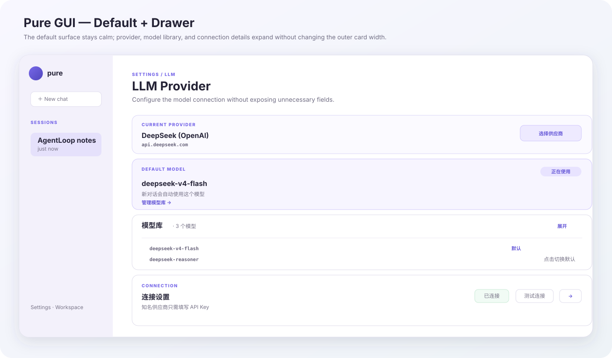
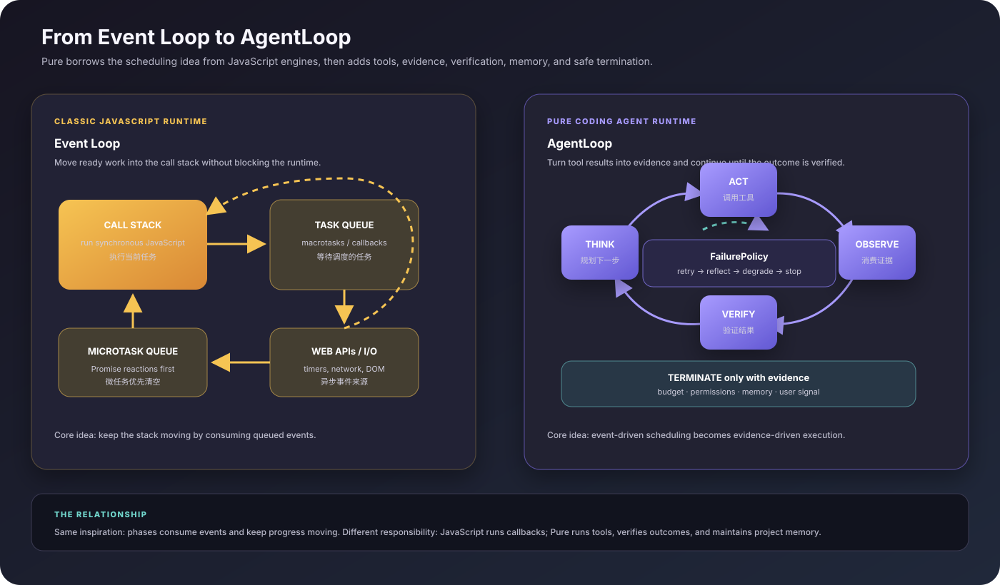
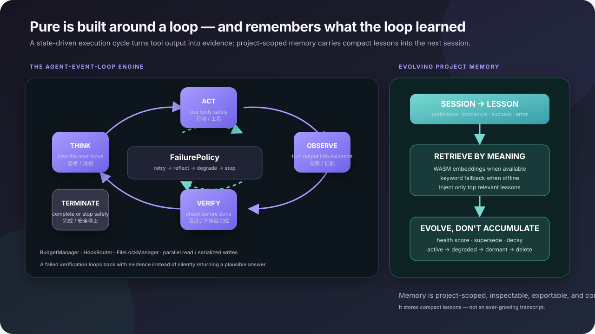

# Pure

**Pure** 是一个本地优先的 AI 编程助手，核心只有两个坚持：**用一个不会轻易停下来的闭环完成任务，用会进化但不会无限膨胀的记忆延续经验**。它的 Agent Loop 灵感来自 JavaScript 引擎中的 Event Loop：借鉴事件驱动、分阶段调度和持续推进的思路，让编码任务不断消费工具结果，直到获得可验证的完成证据。Pure 可以读取、写入和编辑文件，执行 Shell 命令，并在配置 verifier 时验证结果，再把紧凑的项目经验带到下一次会话 — 这一切都通过快速的终端 CLI 或原生 macOS 桌面应用完成。它的对话窗口是会话状态的映射，不是长期记忆的直接倾倒：已保存的会话转录会被映射成界面内容，而检索到的记忆只留在模型上下文中，除非界面明确把它展示出来。

<p align="center">
  
  
  
</p>

---

## 界面视觉与架构图

<p align="center">
  
  <br />
  <em>Pure GUI — 默认态保持清爽，供应商、模型和连接 Drawer 保持统一外宽</em>
  <br /><br />
  
  <br />
  <em>概念对比图：经典 JavaScript Event Loop 的调度方式与 Pure 证据驱动 AgentLoop；概念参考 <a href="https://developer.mozilla.org/en-US/docs/Web/JavaScript/Reference/Execution_model">MDN 执行模型</a> 和 <a href="https://nodejs.org/learn/asynchronous-work/event-loop-timers-and-nexttick">Node.js Event Loop 文档</a></em>
  <br /><br />
  
  <br />
  <em>架构图 — 经过验证的执行闭环与按项目隔离、持续进化的记忆</em>
</p>

上面的视觉图本身就是 Pure 设计的一部分：界面通过渐进式 Drawer 控制配置复杂度，运行时则把每次工具结果变成证据，把通过验证的结果沉淀为候选经验。

---

## Pure 的独特之处

Pure 不只是一个可以调用 Shell 的聊天窗口。它的独特性来自三件事的组合：**证据驱动的执行闭环**、**界面展示与模型上下文分离**，以及**会维护而不是无限堆积的记忆**。

很多 coding agent 的介绍重点是“能调用哪些工具”。Pure 更关注的是：**工具调用之后，智能体是否继续验证、如何从失败中退出，以及下一次是否真的记住了经验**。

| | 基础工具调用助手 | Pure |
|---|---|---|
| **执行方式** | Prompt → 工具 → 回答 | 可持续运行的 `THINK → ACT → OBSERVE → VERIFY` 闭环，直到证据支持完成 |
| **失败处理** | 重试同一路径，或直接报错 | 递进式恢复：`retry → reflect → degrade → stop`，识别重复错误和逻辑陷阱 |
| **上下文** | 对话不断增长，或手动清空 | 检查点、上下文裁剪和项目级记忆共同保持下一轮聚焦 |
| **学习方式** | 用户下次重新解释偏好 | 从成功任务、失败工具和用户偏好提取紧凑经验；明确记录或导入的项目惯例也可以进入记忆 |
| **记忆卫生** | 旧上下文持续堆积 | 健康分、命中次数、取代和衰减推动记忆经历 `活跃 → 降级 → 休眠 → 删除` |

这不是声称其他 agent 的实现都完全一样，而是 Pure 的明确取舍：**执行是状态机，经验是需要维护的记忆库**。

### 1. Agent Loop：在完成之前先拿到证据

Pure 的引擎是一个借鉴 JavaScript 引擎 Event Loop 思路的流式五状态事件循环。它不是 JavaScript 运行时本身，而是把事件驱动、分阶段推进的方式迁移到智能体执行中：每次工具结果都会成为可观察事件，推动下一阶段继续运行：

<p align="center">
  
</p>

```text
THINK → ACT → OBSERVE ──┐
  ↑                     │
  └────────── VERIFY ←──┘
              │
          TERMINATE
```

这个类比有明确边界：JavaScript 运行时调度 callback 和 microtask；Pure 调度思考、工具、观察、验证和失败恢复。借鉴的是持续消费事件、分阶段推进的模型；Pure 的智能体扩展则是：没有证据支持，就不因为“看起来合理”而结束。

- **THINK** — 结合当前请求、工具、预算和相关记忆，规划下一步。
- **ACT** — 在权限、文件锁保护下执行工具调用；只读工作可并行，写入工作串行。
- **OBSERVE** — 把工具结果作为证据放回工作上下文，而不是隐藏的副作用。
- **VERIFY** — 在宣布完成前运行已配置的 verifier；内置 CodingAgent/CLI 路径包含规则检查，集成方也可以提供自定义 verifier。验证失败会带着反思提示回到 THINK。
- **TERMINATE** — 配置 verifier 时在通过验证后完成；未配置 verifier，或预算、策略、用户中断要求停止时安全结束。

循环内置轮次、Token、工具调用次数和时间预算，支持生命周期 Hook 与失败恢复。相同调用连续失败会被识别为死路，智能体会被要求换方法，而不是重复撞同一面墙。

### 1.5 主动预检：先想清楚再修改

用户输入 coding 请求后，Planner 会先做一层轻量的意图与风险评估：判断用户要做什么、可能影响哪些范围、是否容易回滚，以及只读探针能否减少不确定性。

| 评估结果 | 默认行为 |
|---|---|
| **低风险** | 读取相关内容后直接处理，并验证结果。单文件小游戏等小型产物仍走这条路径。 |
| **中风险** | 先只读探索工作区结构和依赖，再做窄范围修改；当前修改验证通过后才扩大范围。 |
| **高风险** | 先解释影响、可逆性和更安全/更窄的替代方案；GUI 和 CLI 都会在任何写入或破坏性命令前要求明确确认。CLI 仅对普通请求默认自动放行，需要逐工具交互确认时使用 `--prompt-on-tool`。 |

这是策略层，不替代具体工具的权限检查。CLI 和 GUI 的展示方式可以不同，但都会把同一份功能契约放入本轮请求上下文；已有复杂计划进行中时，如果新请求变成高风险操作，也会重新打开安全确认，不会静默沿用旧计划。

### 1.55 统一用户诉求处理流程：先证据，再行动

用户请求由 `src/shared/requestWorkflow.ts` 统一编译，GUI 和 CLI 共享同一套前置决策。编译器会把本轮请求、Planner 评估、用户选择的模式、正在进行的计划状态和当前可用工具合并为动态阶段：`direct`、`probe`、`plan` 或 `confirm`，同时生成本轮需要注入的 Prompt 上下文，避免两个界面各自复制规则。

```text
接收 → 评估 → [需要且可用时只读探针]
     → [任务专属计划] → [必要时用户确认]
     → 执行 → 验证 → 交付
```

这里的 workflow 是“编译器”，不是固定任务脚本：具体要读哪些文件、怎么拆步骤、是否调用子智能体、如何验证，仍由模型结合真实工作区证据决定。`probeRequired` 与 `probeAvailable` 分开记录，因此没有工作区或工具不可用时会诚实降级，不会假装已经完成探索。GUI 的任务专属 LLM 分析完成后，还会把最终合并后的风险判断重新编译进本轮 user context，再进入执行。GUI 可以把这轮额外分析显示为真实的思考卡；CLI 则有意不再额外发起一轮预分析模型请求，而是让主执行 LLM 基于同一份证据自行规划，以降低延迟和 Token 成本。两端仍共享同一个保守安全下限和具体工具权限闸门。

### 1.56 自适应运行时控制：策略可变，安全边界不变

第一阶段自适应控制平面位于 `src/shared/adaptiveControl.ts`，运行在 GUI、CLI 共用的 Harness 路径中。每一轮会根据实时信号编译策略：工作区能力、可用工具、verifier 是否存在、本地时间、检索到的已验证流程，以及最近的失败/验证证据；策略随后通过独立的 `<adaptive_context>` 片段动态注入本轮 Prompt。

策略可以改变探索深度、验证强度、委派偏好、失败恢复方式和本地无人执行等级。它不是固定任务脚本，而是给模型的运行时建议：一旦新的工作区证据与建议冲突，模型必须重新调整。权限、路径边界、破坏性操作确认、预算和验证证据仍是程序级不变量，自适应上下文不能绕过或降低它们。

任务完成后，系统会把本轮采用的策略与结果一起记录。只有拿到真实验证证据的运行，才会把策略沉淀为可复用的 `procedure` 记忆；没有验证的输出只能作为会话信息，不能教会未来运行去信任未经证实的路径。因此，同一个需求会随着工作区、时间、工具、记忆和证据变化而选择不同路径，同时不会把自我进化变成无约束地修改安全机制。

### 1.6 上下文压缩：自动、可观察、可保留历史

上下文管理与任务复杂度无关。`ContextEngine` 会保留当前 system 消息、折叠旧的压缩摘要，完整保留 assistant/tool 调用组，清理不完整的悬空 tool 片段，再按消息数和估算 Token 预算裁剪较早的对话。LLM 摘要是尽力而为：摘要失败时仍会把有界的最近窗口交给模型，并明确提示较早消息未生成摘要。

压缩不会固化计划步骤数量、Todo 数量或验证阶段；这些仍由模型结合具体任务决定。CLI REPL 提供 `/compact`，GUI 输入框工具栏提供 `⌁`。两者都只准备下一轮执行上下文，不删除用户可见的对话记录。GUI 会在空闲时自动预压缩，CLI 与 Harness 则在继续会话前按需裁剪。

### 1.65 会话记忆与界面转录分离

GUI 会话不会把“界面显示内容”直接当作 LLM 记忆，对话窗口也不是长期记忆的直接视图，而是会话状态的映射。V2 会话快照明确拆分为三层：`modelContext.messages` 是下一轮真正发送给 LLM 的 canonical 消息；`transcript` 保存分析、思考、工具参数/结果、Markdown 富媒体和文件卡片等界面转录；`uiState` 保存计划游标和暂停状态等界面运行状态。

历史恢复先把 `modelContext.messages` 加载回 Agent，再通过 `src/ui/transcriptProjection.ts` 将 `transcript` 映射为用户消息、分析卡、思考阶段、工具行、助手回复、评估卡和产物卡片，最后由 UI 渲染。可见对话的来源是这层转录映射，而不是把长期记忆条目直接复制进窗口；检索到的记忆会被注入模型专用的 `<session_memory>` 上下文。`displayContent` 等旧版展示字段不会回填空的模型消息，因此界面信息不会污染下一次 LLM 请求；上下文压缩也只影响模型窗口，不删除可见转录。

旧版 `StoredMessage[]` 会在读取时迁移到 V2。工具调用通过 `toolCallId` 配对，未返回的调用显示为 stopped，旧会话缺少 `toolExec` 时会从工具消息补全。详细字段、保存/恢复链路和后续优化方向见 [`docs/session-persistence-and-transcript.md`](docs/session-persistence-and-transcript.md)。

### 1.7 Prompt observability：可观察但不保存秘密

Pure 增加了本地优先的 observability 链路，用于观察 Prompt 组装和 agent 运行过程。编译器记录片段选择、provider/model 预算、工具 schema 成本和 trace 关联；Harness 记录事件数量、工具耗时、usage、验证状态和最终结果。默认只保留长度、哈希和结构化元数据，不保存原始 prompt、工具参数、命令输出或最终回答；评测和调试时可以显式启用 JSONL sink。

### 1.8 真实编码任务评测基线

仓库内置三个确定性的 bugfix/feature/refactor 任务，每个任务都在独立临时工作区中执行，并通过真实 Bun 验证命令评分。不带 `--agent` 时运行 `0/3` control sanity baseline；也可以使用真实 CodingAgent executor 连接 provider：

```bash
bun run eval:baseline
PURE_EVAL_API_KEY=... bun run eval:baseline -- --agent deepseek-openai --strict --report evals/model.latest.json
PURE_EVAL_TRACE=evals/traces.jsonl bun run eval:baseline -- --agent deepseek-openai
```

报告会区分 agent 是否完成和验证是否通过，并记录 fixture hash、运行时、provider/model、Prompt 版本、usage、耗时和成本元数据。这是一套可重复的回归基线，不替代 SWE-bench 或 Terminal-Bench。

### 2. 会进化的项目记忆

Pure 的记忆不是第二份聊天记录。Harness 会把已完成会话压缩为可复用的记忆条目，例如：

- **用户偏好** — 从用户明确表达的语言、框架、工具链或代码风格中提取。
- **流程与成功模式** — 什么方法有效、为什么有效、如何验证；成功会话会同时写入一条完整经验和一条更短、可直接复用的流程。
- **项目惯例** — 明确记录或导入的工作区规则，并与工作区路径绑定，不会和其他仓库的记忆混在一起。
- **错误模式** — 失败路径、恢复方式，以及不应再次尝试的调用。

下一次遇到相似任务时，Pure 只检索最相关的记忆，并注入专用的 `<session_memory>` prompt 区段。GUI 与 CLI 都按项目隔离记忆，避免一个仓库的惯例悄悄污染另一个仓库。

检索优先使用本地 WASM embedding；模型、网络或运行时不可用时自动回退到关键词搜索。记忆通过多维健康分持续维护：新经验可以取代旧策略，长期闲置的条目则从活跃降级到休眠，最终删除。GUI 还提供诊断、遗忘速度设置，以及 JSON / Markdown 导入导出。

> **实际体验上的区别：** Pure 能记住“这个项目偏好什么”和“那个失败调用已经走不通”，但不会把整个上次会话原封不动塞回上下文。

### 功能特性

- **终端 CLI** — 一次性问答或交互式 REPL，支持流式输出
- **桌面 GUI** — 原生 macOS 应用（Tauri），Notion 风格侧边栏和设置面板
- **多供应商** — DeepSeek、Qwen（通义）、GLM（智谱），以及自定义 OpenAI 兼容端点
- **自纠错 Agent Loop** — THINK → ACT → OBSERVE → VERIFY → TERMINATE，带预算、Hook、锁和恢复策略
- **进化项目记忆** — 语义检索、关键词回退、衰减、取代、诊断和导入导出
- **子智能体编排** — 并行调度文件搜索、代码搜索、Web 研究等子智能体
- **MCP 协议** — 接入 Model Context Protocol 服务器，扩展工具能力
- **主动预检** — 执行前判断意图、影响、可逆性和风险；中风险先探针，GUI 和 CLI 都会对高风险先确认，CLI 还可用 `--prompt-on-tool` 对所有工具逐次确认
- **统一用户诉求流程** — GUI/CLI 共用接收、探针、计划、确认、执行和验证决策，并动态注入本轮 Prompt 上下文
- **自适应运行时控制** — GUI、CLI、Harness 共用基于环境和证据的探索、委派、恢复、验证与本地无人执行策略
- **权限系统** — 四种模式：YOLO（自动批准）、NORMAL（写入时确认）、PLAN（只读）、DONT_ASK（静默阻止）
- **会话持久化** — 基于检查点的状态管理，支持会话恢复（`pure --resume`）
- **当前会话撤销** — CLI 使用 `/undo`、GUI 使用输入框旁的 ↶ 撤销最近一次成功写入；如果文件在写入后被外部修改，则拒绝覆盖
- **上下文压缩** — 自动限制历史窗口，也支持 CLI `/compact` 与 GUI `⌁`；按 provider/model 自适应 Prompt 预算，同时计算消息和工具/MCP schema Token，先省略低优先级片段，支持自定义模型元数据，超预算时输出诊断，保持工具调用成组有效且不影响可见对话记录
- **Prompt observability** — PromptAssembler 与 Harness 的本地 trace 关联、隐私安全哈希、有界内存存储和可选版本化 JSONL 导出
- **编码任务评测** — 独立真实 fixture、control baseline、provider-backed CodingAgent runner、只按验证结果评分、usage/成本元数据和适合 CI 的 strict 退出码
- **智能容错解析** — 在报错前自动修复 JSON、Mermaid 和 SVG
- **自动更新** — GUI 通过签名的 `.app.tar.gz` 产物检查并安装更新
- **多语言界面** — 支持英文 / 中文

> 📖 English docs → [README.md](README.md)

---

## 快速开始

### CLI

```bash
# 1. 安装 Bun (https://bun.sh)
curl -fsSL https://bun.sh/install | bash

# 2. 克隆项目并安装依赖
git clone https://github.com/archerzing-tech/pure.git
cd pure
bun install

# 3. 配置 API Key（保存到 ~/.pure/config.json）
bun run cli -- config

# 4. 开始使用
bun run cli -- "解释一下这个项目的架构"
```

也可以从 [Releases](https://github.com/archerzing-tech/pure/releases) 下载预编译的 CLI 二进制文件：

```bash
./pure "用 TypeScript 实现一个限流器"
./pure --workspace /path/to/project    # REPL 模式，可使用文件/命令工具
./pure --resume abc123                 # 恢复之前的会话
```

### GUI（macOS）

从 [Releases](https://github.com/archerzing-tech/pure/releases) 下载 `pure_*.dmg`，挂载后拖入 `/Applications`。或者从源码构建：

```bash
bun install
bun run gui          # 开发模式，带热重载
bun run gui:build    # 生产构建 → src-tauri/target/release/bundle/
```

---

## 架构

```
┌─────────────────────────────────────────────────┐
│                   桌面外壳                         │
│          (Tauri 2 · WebView · Vanilla TS)         │
├─────────────────────────────────────────────────┤
│  Coding Agent（编程智能体）                        │
│  Planner · Intent · Permission · Verifier        │
├─────────────────────────────────────────────────┤
│  Harness（有状态会话管理器）                        │
│  StateManager · ContextEngine · StreamManager     │
├─────────────────────────────────────────────────┤
│  Agent-Event-Loop Engine（无状态 ReAct 循环）      │
│  思考 → 行动 → 观察 → 验证 → 终止                  │
├─────────────────────────────────────────────────┤
│  Adapter Layer（适配器层，所有 I/O）                │
│  LLM（DeepSeek/Qwen/GLM）· 工具 · 存储 · MCP     │
├─────────────────────────────────────────────────┤
│  Rust / Tauri IPC（操作系统能力）                   │
│  Shell PTY · 密钥存储 · HTTP/2                    │
└─────────────────────────────────────────────────┘
```

智能体核心使用 TypeScript 在 WebView 中运行。Rust（Tauri）提供操作系统级别的能力 — Shell PTY 流式输出、密钥存储访问和 LLM API 中继（确保 API Key 不会进入 JS 上下文）。

---

## 项目结构

```
pure/
├── src/
│   ├── cli.ts                    # CLI 入口（一次性 + REPL）
│   ├── engine/                   # 无状态 ReAct 事件循环
│   │   ├── AgentLoopEngine.ts    # 五状态循环，带预算 + 钩子
│   │   ├── BudgetManager.ts      # Token/轮次/时间 预算追踪
│   │   └── FailurePolicy.ts      # 递进式恢复策略：重试 → 反思 → 停止
│   ├── harness/                  # 有状态会话管理
│   │   ├── Harness.ts            # 会话生命周期 + 检查点持久化
│   │   ├── ContextEngine.ts      # 自动/手动上下文压缩
│   │   ├── StateManager.ts       # 检查点保存/恢复
│   │   └── StreamManager.ts      # Token 流式输出 + UI 渲染
│   ├── coding-agent/             # 应用层
│   │   ├── CodingAgent.ts        # 智能体装配器
│   │   ├── Planner.ts            # 意图/风险分析 + 计划生成
│   │   ├── ToolRegistry.ts       # 工具调度 + 权限门控
│   │   ├── PermissionManager.ts  # YOLO / NORMAL / PLAN 权限模式
│   │   ├── Verifier.ts           # 输出验证
│   │   └── SubagentOrchestrator.ts  # 并行子智能体调度
│   ├── adapter/                  # I/O 适配器（LLM、工具、存储、MCP）
│   │   ├── openai/               # OpenAI 兼容 API 适配器
│   │   ├── deepseek/             # DeepSeek Anthropic 风格适配器
│   │   ├── node/                 # 文件系统 + Shell 工具适配器
│   │   ├── mcp/                  # MCP 传输层（stdio、HTTP）
│   │   └── storage/              # FSStore + SQLiteStore
│   ├── ui/                       # WebView 界面（聊天、设置、Markdown）
│   └── shared/                   # 共享类型、Prompt 组装、observability、i18n、记忆
│       ├── PromptAssembler.ts    # GUI / CLI / Harness 统一 Prompt 编译器
│       ├── adaptiveControl.ts     # 从环境/证据选择运行时策略
│       ├── requestWorkflow.ts     # 统一动态接收/探针/计划/确认编译器
│       ├── promptObservability.ts # 隐私安全 trace 模型与收集器
│       └── FilePromptObservationStore.ts # Node-only JSONL trace sink
│   ├── evaluation/               # 确定性编码任务 fixture + 真实 runner
│   │   ├── codingTaskBaseline.ts  # fixture、验证和报告
│   │   └── codingAgentExecutor.ts # provider-backed CodingAgent executor
├── evals/                        # 评测协议与基线文档
├── src-tauri/                    # Rust / Tauri 后端
│   ├── src/                      # IPC 命令、会话管理器
│   └── tauri.conf.json           # 应用配置 + 更新密钥
├── scripts/                      # 构建、签名、部署脚本
├── system-prompt.md              # 智能体系统提示词（公开契约）
└── pure Spec.md                  # 架构主规范
```

---

## 配置

### 供应商 & API Key

通过 `pure config`（CLI）或设置面板（GUI）一次性配置。配置持久化在 `~/.pure/config.json`。

支持的供应商：

| 供应商 | CLI 参数 | 环境变量 |
|---|---|---|
| DeepSeek（OpenAI API） | `--provider deepseek-openai` | `DEEPSEEK_API_KEY` |
| DeepSeek（Anthropic API） | `--provider deepseek-anthropic` | `DEEPSEEK_API_KEY` |
| Qwen / DashScope | `--provider qwen` | `DASHSCOPE_API_KEY` |
| GLM / 智谱 | `--provider glm` | `ZHIPU_API_KEY` |

GUI 设置 → LLM 页面支持一个供应商配置多个大模型。默认界面只突出当前供应商和默认模型；点击「选择供应商」可展开或收起供应商 Drawer，点击「管理模型库」可添加、删除或设置默认模型，点击「测试连接」可检测当前端点。知名供应商使用内置端点和默认模型，只需填写 API Key；Base URL 和供应商名称只对自定义端点显示。

### Web 搜索与抓取 Key（CLI，全部可选）

不配置任何 key，CLI 也能通过免费 HTML 后端（Sogou / cn.bing.com / DuckDuckGo / Bing）搜索，并通过免 key 公共 API 回答结构化查询（天气、地理编码、新闻、维基、IP、汇率、股票、GitHub、航班动态）。可选 key 提升质量与稳定性——配置的多个后端按「第一个出结果者胜」降级，失败/被限流的后端会进入短暂冷却而不是反复重试：

| 环境变量 | 用途 | 免费额度 | 申请链接 |
|---|---|---|---|
| `SERPER_API_KEY` | Google SERP 后端（中英文索引最好） | 2500 次（一次性） | [serper.dev](https://serper.dev) |
| `TAVILY_API_KEY` | Tavily 搜索后端 | 1000 次/月 | [tavily.com](https://tavily.com) |
| `EXA_API_KEY` | Exa 神经搜索后端 | 开户 $20 + 每月 $10 循环 | [exa.ai](https://exa.ai) |
| `PURE_JINA_API_KEY` | `web_scrape` 兜底（r.jina.ai） | 免 key 可用，带 key 提高限额 | [jina.ai](https://jina.ai) |
| `PURE_FIRECRAWL_API_KEY` | `web_scrape` 第二兜底 | 约 500–1000 credits/月 | [firecrawl.dev](https://firecrawl.dev) |
| `PURE_AVIATIONSTACK_KEY` | 航班动态（如「CA981 航班动态」） | 100 次/月 | [aviationstack.com](https://aviationstack.com) |
| `PURE_LOCATION` | 天气查询缺城市时的默认城市 | — | — |

GUI 设置 → 工具 → Web 工具页内置 Serper / Tavily 配置项，附一键申请链接；其余 CLI key 通过环境变量设置。

Web 工具结果带缓存，重复查询不会反复消耗免费额度：`web_search`（15 分钟）、`web_public_api`（按类别——天气/新闻/股票分钟级、地理编码/维基周级）、`web_scrape`/`web_fetch`（1 小时）统一读写 `~/.pure/cache/web-cache.json`，CLI 与 GUI 共享同一文件与 key 方案。缓存文件有上限（200 条、最旧优先淘汰、单值 30 KB）且容忍损坏。`PURE_WEB_CACHE=off` 关闭缓存，`PURE_CACHE_DIR` 可改目录。

#### Scrapling MCP 服务器（可选）

对付最难的反爬站点（Cloudflare 级别、JS 重页面），Scrapling 自带的 [MCP server](https://scrapling.readthedocs.io/en/latest/ai/mcp-server.html) 可以把自适应隐身抓取能力作为普通 MCP 工具接入 Pure——选择加入制，因为它需要 Python + uv（Pure 本身不捆绑浏览器）。2026-08 实测：启动命令必须是 `uvx --from "scrapling[ai]" scrapling mcp`——裸 `uvx scrapling mcp` 会装到空壳基础包，报 `ModuleNotFoundError: click` 直接退出。

```bash
pip install "scrapling[ai]"   # 一次性安装
```

两种启用方式：
- **GUI**：设置 → MCP → 「＋ Scrapling 抓取」一键注册（浏览器工具请求超时 120 秒）。
- **CLI**：每次运行传 flag，或把 `mcpServers` 写进 `~/.pure/config.json`（GUI 保存的也是这个文件）：

```bash
pure --workspace . --mcp-server "scrapling:uvx --from scrapling[ai] scrapling mcp" "抓一下这个网站"
```

下一次会话的工具列表会包含 Scrapling 的 fetch/scrape 工具（服务名前缀 `scrapling__…`），与其他 MCP 工具一样受权限管控。

#### MCP 工具过滤（GUI + CLI）

MCP 服务器可能一次性暴露大量工具；为避免第三方工具列表挤占内置工具选择，完整名（`serverName__tool`）命中排除前缀的工具不会被注册。在 **设置 → MCP → 排除 MCP 工具前缀** 里配置（如 `scrapling__bulk_, …`），或 CLI 重复传 `--mcp-exclude-prefix <前缀>`。服务器保持连接，只是匹配的工具对模型不可见。

### 权限模式

| 模式 | 读取操作 | 写入 & Shell 命令 |
|---|---|---|
| **YOLO** | 自动批准 | 自动批准 |
| **NORMAL**（默认） | 自动批准 | 每次操作弹出确认 |
| **PLAN** | 允许 | 阻止 |
| **DONT_ASK** | 自动批准 | 静默阻止 |

---

## CLI 用法

```bash
# 一次性：提问或执行任务
pure "把认证模块重构为 JWT 方式"
pure "AgentLoopEngine.ts 是干什么的？"

# REPL：在当前目录启动交互式会话
pure --workspace .

# 恢复之前的会话
pure --resume session_1712345678901

# 单次覆盖供应商/模型
pure --provider qwen --model qwen3-coder-next "写一个 React 表单验证 Hook"

# REPL 命令
/exit       # 退出
/clear      # 清空对话上下文
/compact    # 压缩下一轮执行上下文，不删除可见历史
Ctrl+C      # 取消当前生成（再按一次强制退出）
/undo       # 恢复本次会话最近一次成功的写入批次
```

GUI 输入框旁也提供同一项当前会话撤销操作（↶）和上下文压缩操作（⌁）。压缩只影响下一轮执行窗口，不删除可见历史；撤销只保留在当前进程内，不替代跨会话检查点，也不会删除工作区之外的文件。

如果希望在具体工具调用前逐次确认：

```bash
pure --prompt-on-tool "执行这次迁移"
```

### 编码任务评测

```bash
bun run eval:baseline                                      # control baseline（预期 0/3）
PURE_EVAL_API_KEY=... bun run eval:baseline -- --agent deepseek-openai --strict
PURE_EVAL_TRACE=evals/traces.jsonl bun run eval:baseline -- --agent deepseek-openai
```

支持的 executor provider 包括 `deepseek-openai`、`deepseek-anthropic`、`qwen`、`glm`、`mock`，也支持通过 `PURE_EVAL_BASE_URL` 接入自定义 OpenAI 兼容端点。每个任务使用独立工作区；报告只保存哈希和元数据，不保存源码或命令输出。

---

## 开发

```bash
# 安装依赖
bun install

# 类型检查
bun run typecheck

# 运行测试
bun test

# CLI（开发模式）
bun run cli

# GUI（开发模式，带热重载）
bun run gui

# 构建二进制文件
bun run cli:build          # → ./pure（独立 CLI 二进制）
bun run gui:build          # → .app + .dmg + .tar.gz（自动更新用）
```

### 构建发布版（macOS）

```bash
# 完整构建（含 Tauri 更新签名 + macOS 代码签名）
bun run build:gui:mac
```

项目包含 GitHub Actions 工作流（`.github/workflows/release.yml`），每次推送 `v*` 标签时会自动构建 CLI 和 GUI。

---

## 图表 DSL

聊天回复中的 ```` ```chart ```` 代码块会用极简 DSL 渲染为图表（柱状、横向柱状、折线、饼图、散点、K 线、雷达、树、矩形树图、旭日图）：

````markdown
```chart
type: line
title: 北京 vs 上海气温
unit: ℃
周一 25 27
周二 26 28
周三 24 26
```
````

除 `type:`/`title:`/`unit:` 外的每行是一条数据：单系列用 `标签 数值`，多系列用 `标签 数值1 数值2 …`。

### 多系列（表头 + 多列）

加上一行表头、且每行含两列以上数值时，**每列渲染为一条系列**——第一列是 x 轴标签，其余列名作为系列名。悬停某个类目时，tooltip 会联动显示所有系列在同一位置的数值对比。

````markdown
```chart
type: line
title: 三地气温对比
unit: ℃
日期 北京 上海 广州
周一 25 27 30
周二 26 28 31
周三 24 29 32
```
````

同样的数据结构也支持 **markdown 表格**（可含 `---` 分隔行）、**CSV** 或 **tab 分隔**：

````markdown
```chart
type: line
| 月份 | 电商 | 门店 | 批发 |
| --- | --- | --- | --- |
| 一月 | 120 | 80 | 60 |
| 二月 | 150 | 90 | 55 |
```
````

多系列同样适用于 `bar` / `hbar`；`pie` 恒用第一列作为数值（多系列会渲染成重叠圆环，已自动回退）。

### 其它图族

```chart 块支持更多的 ECharts 图型，数据形状各不相同：

````markdown
```chart
type: scatter
title: 身高体重分布
小明 170 65
小红 160 50
小刚 180 75
```
````

- **scatter（散点图）**：每行一个点，`名称 x y`。
- **kline（K 线图）**：表头 `日期 开盘 收盘 最低 最高`，每行 `日期 开盘 收盘 最低 最高`（顺序固定）。

````markdown
```chart
type: kline
日期 开盘 收盘 最低 最高
2026-08-01 10 12 9 13
2026-08-02 12 11 10 12
```
````

- **radar（雷达图）**：`indicators: 维度1 维度2 …`（或一行表头），每行一条系列 `名称 v1 v2 …`。

````markdown
```chart
type: radar
title: 团队技能
indicators: 速度 攻击 防御
团队A 80 90 70
团队B 60 70 80
```
````

- **tree / treemap / sunburst（树 / 矩形树图 / 旭日图）**：用缩进表示层级（每 2 空格一级），首行为根节点；treemap / sunburst 每行末尾的数字是该节点的值。

````markdown
```chart
type: treemap
销售
  电子 500
    手机 300
    电脑 200
  家电 300
```
````

### 规则与提示

- **类型**：`bar`、`hbar`、`line`、`pie`、`scatter`、`kline`、`radar`、`tree`、`treemap`、`sunburst` —— `type:` 行或裸首词均可（也接受 `散点图` / `雷达图` 等中文写法）；缺省为 `bar`。
- **JSON**：也接受 `{ "type": "pie", "data": [["a", 1], ["b", 2]] }` 形式；层级图可用 `{ "type": "tree", "data": { "name": "根", "children": [...] } }`。
- **系列名**：取自表头行；无表头时回退为 `系列1` / `系列2` / …。
- **数字开头的行**：首个数字 token 恒作为 x 轴标签——`2024 10 20` 表示年份是标签而非数据值。
- **单位**：`25℃`、`50%`、`1.2mm` 会被剥离并显示在 tooltip / 坐标轴。
- **交互**：双击任意图表可打开全屏缩放查看器；悬浮「下载图片」按钮可导出 PNG。
- 图表由懒加载的 echarts 构建（tree-shaken、SVG 渲染器）渲染，并自动跟随应用亮/暗主题。
- 绘制图表/图片时请直接使用 ```` ```chart ```` / ```` ```svg ```` 块，不要用 Python 脚本等中间代码替代最终图像。

---

## 自动更新

GUI 内置 Tauri 自动更新器。发布新版本时：

1. CI 构建产生 `pure.app.tar.gz` + `.sig`（minisign 签名）
2. 将产物托管在更新端点（`https://releases.pure.app/latest.json`）
3. 应用会轮询端点，提示用户安装更新

密钥生成和更新服务器配置详见 [SIGNING.md](SIGNING.md)。

---

## 许可证

MIT — 详见 [LICENSE](LICENSE)
