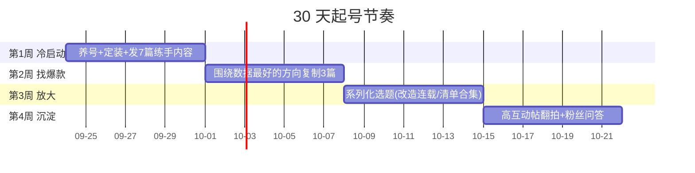

# 宝妈家居账号 30 天起号方案

> 制定时间：2026-09-23 ｜ 平台：小红书 ｜ 依据：新榜 529 万篇家居笔记拆解、小红书 2026 年度居住趋势（"痛屋"类笔记同比增长 250%）、2025 家生活场景白皮书

## 一、定位（先定死，不再摇摆）

**一句话定位**：普通工薪家庭宝妈，把「住了多年、越住越乱的家」一点点改造成全家想待着的地方——真实、平价、可抄作业。

- **人设**：90 后宝妈（孩子 1–6 岁区间最泛），西安，普通小区房，不炫富不装完美
- **差异化**：不拍精装样板间，拍"有人气儿的真实家 + 乱→整齐的过程感"。过程感是宝妈账号最大的信任来源
- **内容四象限**（发布比例）：
  1. 好物分享（40%）——门槛最低、赞藏最高，素人练手主力（新榜结论）
  2. 收纳整理（30%）——宝妈痛点核心：玩具、儿童衣物、厨房、玄关
  3. 小改造/对比（20%）——"痛屋→治愈"过程，最容易被收藏
  4. 踩坑与日常（10%）——建立信任、拉评论区互动

**对标账号动作**：起号前 3 天，搜索并精读 10 个对标（关键词：宝妈收纳、玩具收纳、儿童房改造、家庭好物），记录它们最近 30 天赞藏最高的 5 篇的封面构图和标题句式，填入《标题选题库.md》。

## 二、30 天路线图

| 周次 | 目标 | 关键动作 | 检验标准 |
|---|---|---|---|
| 第 1 周 | 账号立住、测出方向 | 每天 1 篇，4 个象限各试水 | 平均曝光 >500，至少 1 篇互动率 >5% |
| 第 2 周 | 出第一篇小爆款 | 把第 1 周数据前 2 的选题换角度重做 | 单篇赞藏 >100 |
| 第 3 周 | 系列化留住人 | 开"100 件平价好物""角落改造连载"栏目 | 粉丝 >300，主页访问率上升 |
| 第 4 周 | 冲 500–1500 粉 | 合集功能整理、评论区问答翻拍成笔记 | 500 粉（开通蒲公英的门槛是 1000，继续攒） |

## 三、爆款笔记公式（本周执行版）

- **封面**：9:16 或 3:4 竖图，大字标题 ≤10 字压在画面上；对比改造类必须"前后同框"
- **标题**：数字 + 身份/痛点 + 结果承诺（例：「98㎡住三口人，玩具从不清爽→3 个动作睡前收干净」）
- **正文**：首行痛点共鸣 → 中间干货分点（每点 ≤2 行）→ 结尾一句提问引导评论
- **标签**：5–8 个，1 个大流量词（#家居好物）+ 3 个精准词（#玩具收纳）+ 2 个人群词（#宝妈日常 #90后宝妈）
- **发布时间**：宝妈刷手机高峰 21:00–23:00 为主，午休 12:00–13:00 为辅；发布后 1 小时内守评论区秒回

## 四、数据复盘表（每周日填一次）

| 日期 | 标题 | 曝光 | 点击率 | 赞 | 藏 | 评 | 粉丝增量 | 结论/下一步 |
|---|---|---|---|---|---|---|---|---|
|  |  |  |  |  |  |  |  |  |

判定规则：点击率 <8% → 换封面；赞藏低但点击高 → 换内容结构；评论多 → 顺着评论找下一篇选题。

## 五、风险与红线

- 前 3 天先"养号"：每天正常刷 30 分钟、点赞评论同行内容，再发第一篇
- 不碰绝对化用语（"最便宜""第一"）、不虚构"改造前是毛坯"之类的假剧情，被判营销号一次限流一周
- 30 天**不接商单、不发硬广**，第 5 周起再考虑好物体验类合作；1000 粉之前变现路径只有自购分享积累信任
- 期望管理：30 天做到 500–1500 粉、1–2 篇小爆款是现实目标；"30 天变现"对素人不现实，别为短期数据破坏人设

## 六、文件清单

- `30天起号方案.md` —— 本文件，路线图与执行规则
- `第一周内容.md` —— 7 篇笔记完整文案、封面与拍摄清单
- `标题选题库.md` —— 20+ 备用标题与选题公式，覆盖第 2–4 周
